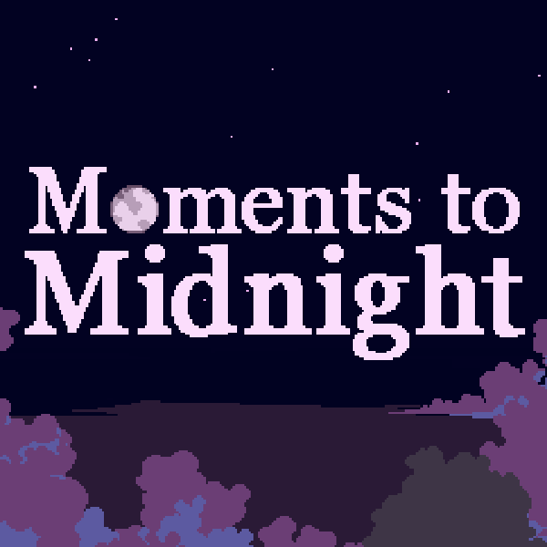

# Moments to Midnight



Moments to Midnight is our submission to the  <a href="https://itch.io/jam/ssjnarrative">2023 Summer Slow Jam: Narrative</a>

Here you will find the release date source code for the game, releases, concept art, screenshots, etc. 

>**Note**
>Only the pre-alpha release as submitted for the 2023 Summer Game Jam: Narrative is being shared on GitHub for all to view and read. Subsequent updates will not be available here and will only be available on our official Itch.io page and platform store fronts. We decided to release the source code as submitted for the game jam to enable more players to access and learn about the process.


# Releases
Here will be some links to download the game

# Links
- <a href="https://cuttingstonestudios.itch.io/moments-to-midnight">Find our game on Itch.io</a>
- <a href="https://twitter.com/csstudios_us">Follow us on Twitter</a>
- <a href="https://www.facebook.com/CuttingStoneStudios/">Follow us on Facebook</a>
- <a href="https://www.instagram.com/CuttingStoneStudios/">Follow us on Instagram</a>
- <a href="https://www.twitch.tv/CuttingStoneStudios/">Follow us on Twitch</a>
- <a href="https://cuttingstonestudios.itch.io/">Follow us on Itch.io</a>

# Credits
Aside from our core team, we've had plenty of assistance from friends, family, and colleagues. Whether it be dialogue, play-testing, or help with some artwork, we feel they all deserve some credit.


| Name  | Contributions | Github Profile |
| ------------- | ------------- | ------------- |
| Brandon | Core Game Mechanics and Functionality | <a href=https://github.com/lolsheep> lolsheep</a> |
| Eve | Core Game Mechanics and Functionality  | <a href=https://github.com/Digit112> Digit112</a> |
| Harpreet | Visuals, Storytelling, and Dialogue  | <a href=https://github.com/shiptooster> shiptooster</a> |
| Jae | Project Management  | <a href=https://github.com/d0rtilla>d0rtilla</a> |
| Jeff | Visuals, Odds and Ends  | <a href=https://github.com/FamilyManTech>FamilyManTech</a> |
| Naemis | Storytelling, Dialogue, Odds and Ends  | N/A
| root | DevSecOps and Project Management  | <a href=https://github.com/ravagedshell> ravagedshell</a> |
| Vaporwave-mints | Storytelling, Dialogue, Odds and Ends  | N/A


# License
This pre-alpha release is released under the The MIT License, a permissive software license that allows for broad reuse and repackaging of this software. Please ensure you include the original copyright notice on any derivative works.
```
The MIT License
Copyright © 2023 Cutting Stone Studios, LLC.

Permission is hereby granted, free of charge, to any person obtaining a copy of this software and associated documentation files (the “Software”), to deal in the Software without restriction, including without limitation the rights to use, copy, modify, merge, publish, distribute, sublicense, and/or sell copies of the Software, and to permit persons to whom the Software is furnished to do so, subject to the following conditions:

The above copyright notice and this permission notice shall be included in all copies or substantial portions of the Software.

THE SOFTWARE IS PROVIDED “AS IS”, WITHOUT WARRANTY OF ANY KIND, EXPRESS OR IMPLIED, INCLUDING BUT NOT LIMITED TO THE WARRANTIES OF MERCHANTABILITY, FITNESS FOR A PARTICULAR PURPOSE AND NONINFRINGEMENT. IN NO EVENT SHALL THE AUTHORS OR COPYRIGHT HOLDERS BE LIABLE FOR ANY CLAIM, DAMAGES OR OTHER LIABILITY, WHETHER IN AN ACTION OF CONTRACT, TORT OR OTHERWISE, ARISING FROM, OUT OF OR IN CONNECTION WITH THE SOFTWARE OR THE USE OR OTHER DEALINGS IN THE SOFTWARE.
```


